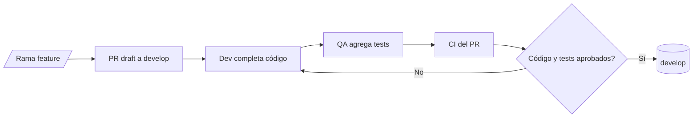
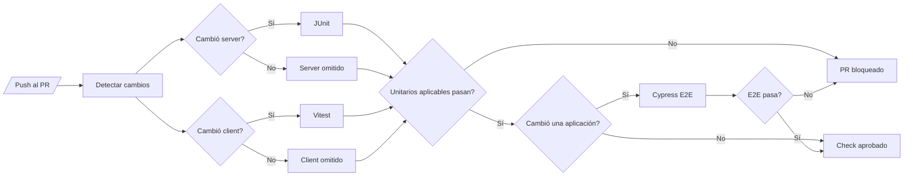
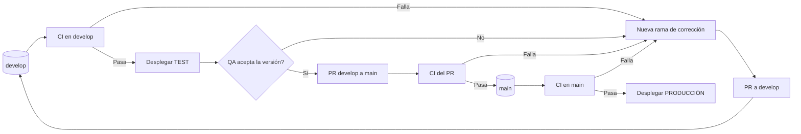
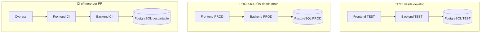

# Plan de testing automatizado

## Objetivo

Detectar regresiones antes de integrar un pull request mediante tres niveles complementarios:

| Nivel | Herramienta | Alcance |
|---|---|---|
| Backend unitario | JUnit 5 + `kotlin.test` | Validadores, mappers y lógica de servicios sin levantar Spring cuando no sea necesario. |
| Frontend unitario | Vitest | Helpers, schemas, hooks y comportamiento de componentes. |
| End-to-end (E2E) | Cypress | Flujos completos atravesando navegador, frontend, API y base de datos. |

Cypress se considera E2E en este plan. No reemplaza los tests unitarios: confirma que las partes funcionan juntas, pero no localiza por sí solo dónde está el error.

## Ejecución en CI

Cada pull request debe ejecutar los tests de la aplicación modificada. Si cambia el cliente y el servidor, sus tests unitarios se ejecutan en paralelo. Cypress debe comenzar únicamente cuando todos los tests unitarios aplicables hayan terminado correctamente.

```text
                        ┌─> JUnit, si cambia server ──┐
detectar cambios del PR ┤                             ├─> Cypress E2E ──> CI aprobada
                        └─> Vitest, si cambia client ─┘
```

La dependencia se implementará en GitHub Actions con:

```yaml
e2e:
  needs:
    - changes
    - server-test
    - client-test
  if: >-
    always() &&
    (needs.changes.outputs.client == 'true' || needs.changes.outputs.server == 'true') &&
    (needs.server-test.result == 'success' || needs.server-test.result == 'skipped') &&
    (needs.client-test.result == 'success' || needs.client-test.result == 'skipped')
```

Reglas:

- El job `changes` detecta las áreas modificadas, siguiendo el mecanismo que ya existe en `.github/workflows/ci.yml`.
- Si cambia `server/**`, se ejecuta toda la suite JUnit.
- Si cambia `client/**`, se ejecuta toda la suite Vitest.
- Si cambian ambas áreas, JUnit y Vitest se ejecutan en paralelo.
- Si cambia `client/**` o `server/**`, Cypress se ejecuta después de todos los unitarios aplicables. El flujo E2E puede romperse por un cambio en cualquiera de las dos aplicaciones.
- Si solo cambian archivos de documentación, no se ejecutan estas suites.
- Un cambio en `.github/workflows/ci.yml` debe ejecutar las tres suites para validar el propio workflow.
- Si falla un test unitario aplicable, Cypress no se ejecuta.
- Si falla Cypress, el pull request y el deploy quedan bloqueados.
- Los jobs paralelos no deben compartir estado ni archivos generados.
- La selección se realiza por aplicación, no por archivo de test individual. Las suites unitarias deben mantenerse rápidas y un cambio compartido puede afectar varios casos indirectamente.
- El cliente usa npm y `package-lock.json` tanto localmente como en CI.

Matriz de ejecución:

| Archivos modificados | JUnit | Vitest | Cypress |
|---|---:|---:|---:|
| Solo `server/**` | Sí | No | Sí, después de JUnit |
| Solo `client/**` | No | Sí | Sí, después de Vitest |
| `server/**` y `client/**` | Sí | Sí | Sí, después de ambos |
| `.github/workflows/ci.yml` | Sí | Sí | Sí, después de ambos |
| Solo documentación | No | No | No |

Comandos previstos:

```bash
# Backend
cd server
./gradlew test

# Frontend
cd client
npm ci
npm test

# E2E, con frontend, backend y base de pruebas levantados
cd client
npm run test:e2e
```

## Ubicación y nombres

### JUnit

- Ubicación: `server/src/test/kotlin`, replicando el package de producción.
- Nombre de archivo: `NombreDeClaseTest.kt`.
- Nombre del test: describir el comportamiento esperado, por ejemplo ``devuelve roles unicos y ordenados``.

### Vitest

- Ubicación: junto al archivo probado para que sea fácil encontrarlo.
- Nombre de archivo: `archivo.test.ts` o `Componente.test.tsx`.
- Probar el resultado visible o público, no detalles internos de implementación.

### Cypress

- Ubicación: `client/cypress/e2e`.
- Nombre de archivo: `flujo.cy.ts`, por ejemplo `login.cy.ts`.
- Seleccionar elementos por nombre, texto o rol accesible. Usar `data-cy` solo cuando no exista un selector estable y significativo.

## Qué probar

### Backend con JUnit

Prioridad inicial:

1. Validaciones y permisos.
2. Reglas de negocio de los servicios.
3. Mappers con transformaciones, ordenamiento o eliminación de duplicados.
4. Controllers y repositories solo cuando la integración con Spring o JPA sea parte del comportamiento que se quiere verificar.

No hace falta probar DTOs sin lógica, getters o código generado.

### Frontend con Vitest

Prioridad inicial:

1. Schemas y transformaciones.
2. Hooks con decisiones o estados relevantes.
3. Formularios y componentes con interacción.
4. Estados de carga, error, permisos y datos vacíos.

No hace falta probar componentes puramente visuales de terceros ni snapshots extensos.

### Flujos con Cypress

Primera suite propuesta, cuando cada flujo esté conectado a la API real:

1. Inicio de sesión y redirección según el rol.
2. Selección o cambio de rol.
3. Creación de una solicitud ciudadana.
4. Evaluación o resolución de una solicitud desde gestión.

Agregar un nuevo flujo E2E únicamente cuando represente una operación crítica que no esté suficientemente cubierta por los anteriores.

## Datos y entorno E2E

Antes de activar Cypress en CI se necesita:

- Una base PostgreSQL exclusiva y descartable para el job.
- Un perfil de backend para E2E que nunca apunte a datos compartidos o productivos.
- Datos iniciales conocidos: al menos un ciudadano, un usuario municipal, sus roles y permisos.
- Un mecanismo repetible para preparar o limpiar los datos antes de cada escenario.
- Backend y frontend con health checks antes de lanzar Cypress.

Cada test debe poder ejecutarse solo y en cualquier orden. Un test no puede depender de datos creados por otro.

## Flujo del pull request con QA/tester

El código y sus tests deben integrarse mediante la misma rama `feature/*` y el mismo pull request:

1. El dev crea la rama, comienza la implementación y abre un pull request en estado draft hacia `develop`.
2. Cuando la funcionalidad está lista para probar, el dev avisa a QA sin sacar todavía el PR de draft.
3. QA/tester obtiene esa misma rama, revisa los criterios de aceptación y agrega los tests JUnit, Vitest y Cypress que correspondan al cambio.
4. QA realiza también las pruebas manuales o exploratorias necesarias.
5. Si QA encuentra un defecto, lo documenta en el PR y el dev lo corrige en la misma rama. QA agrega un test de regresión cuando corresponda.
6. Cada push del dev o QA actualiza el mismo PR y vuelve a ejecutar los checks automáticos aplicables.
7. El PR se marca listo para revisión cuando contiene la implementación y sus tests.
8. Solo se integra a `develop` con CI verde, validación de QA y aprobación técnica.

No se crea un segundo PR exclusivo para los tests de la funcionalidad: eso permitiría integrar código sin su cobertura y agregaría una dependencia innecesaria entre ramas.

## Entornos y promoción

No se agrega una rama `test`. Las ramas y los entornos tienen esta relación:

| Fuente | Entorno | Propósito |
|---|---|---|
| Pull request `feature/* -> develop` | Runner efímero de CI | JUnit, Vitest y Cypress con servicios y base descartables. |
| `develop` | TEST/QA | Validación manual e integración de funcionalidades ya aceptadas en su PR. |
| `main` | PRODUCCIÓN | Versión aprobada por QA en TEST. |

TEST y PRODUCCIÓN deben tener URLs, credenciales, secretos y bases PostgreSQL separados. Cypress de CI nunca debe usar ninguna de esas dos bases persistentes.

### Flujo de una funcionalidad



### Flujo de CI del pull request



### Promoción entre entornos



### Topología de entornos



Al encontrar un defecto antes del merge, dev y QA continúan trabajando en la rama original. Si el defecto aparece después del merge en TEST, se crea una nueva rama `feature/*` desde `develop`; no se corrige directamente sobre `develop`.

## Responsabilidad del equipo

- El dev implementa la funcionalidad, facilita que sea testeable y corrige los defectos de producto detectados.
- QA/tester diseña los casos y crea o actualiza los tests JUnit, Vitest y Cypress correspondientes en la misma rama de la funcionalidad.
- Dev y QA distinguen si una falla proviene del producto o del propio test; la corrige quien corresponda.
- La persona revisora comprueba que el test cubra comportamiento y que falle si se elimina la implementación probada.
- Los bugs corregidos deben dejar un test de regresión en el nivel más bajo que reproduzca el problema.
- No se exige un porcentaje de cobertura inicial. Se priorizan reglas y recorridos con riesgo real.

## Implementación por etapas

### Etapa 1 — Unitarios y CI

- Configurar Vitest en el cliente.
- Agregar los scripts `test` para `vitest run` y `test:watch` para `vitest`.
- Agregar los primeros tests unitarios de JUnit y Vitest.
- Crear los jobs paralelos `server-test` y `client-test`.
- Reutilizar el job `changes` para ejecutar únicamente las suites de las aplicaciones modificadas.

### Etapa 2 — Entorno E2E

- Agregar Cypress al cliente.
- Agregar el script `test:e2e` para `cypress run`.
- Definir el perfil y la base PostgreSQL descartable para E2E.
- Automatizar el inicio y la espera saludable de servidor y cliente.
- Crear un único smoke test del flujo de login cuando esté conectado al backend.

### Etapa 3 — Flujos críticos

- Incorporar los demás escenarios de la primera suite.
- Guardar screenshots y videos como artefactos solo cuando Cypress falle.
- Revisar tests lentos o inestables antes de ampliar la suite.

## Definición de terminado

La estrategia queda operativa cuando:

- JUnit y Vitest se seleccionan por aplicación modificada, corren en paralelo cuando ambos aplican y bloquean Cypress si fallan.
- Cypress usa una base descartable y prueba al menos un flujo real de punta a punta.
- Los tres niveles se ejecutan automáticamente en los pull requests donde correspondan.
- Cualquier integrante puede ejecutar los mismos comandos localmente.
- La protección de ramas exige los checks de testing antes del merge.
