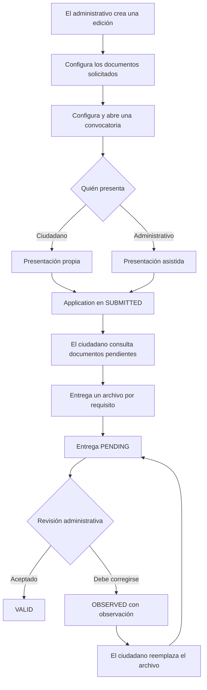

# Flujo completo de solicitudes y documentación

[Inicio de la guía](../README.md) · [Reglas funcionales de solicitudes](application.md) · [Programas y ediciones](program.md) · [Convocatorias](enrollmentperiod.md)

Esta guía explica cómo preparar una edición, indicar qué documentación pide, presentar una solicitud, entregar archivos y revisarlos. Incluye el flujo ciudadano y el administrativo disponible actualmente.

## Dónde se define la documentación requerida

La documentación **no se configura directamente en cada solicitud**. Se configura una vez en la edición del programa y todas las solicitudes de esa edición heredan ese catálogo:

```text
Programa
└── Edición
    ├── Documentos requeridos
    ├── Convocatorias
    └── Solicitudes de esas convocatorias
```

Por eso, para indicar que una solicitud debe incluir DNI, constancia de domicilio o cualquier otro archivo, el administrativo agrega esos requisitos a `ProgramEdition` antes de recibir la primera solicitud.

Una `Application` ya sabe qué documentación le corresponde mediante su `programEditionId`. El cuerpo utilizado para presentar una solicitud no recibe una lista de documentos.

## Vista general



Los estados `PENDING`, `VALID` y `OBSERVED` pertenecen a cada documento entregado. Cargar o revisar archivos no cambia el estado general de la solicitud.

## 1. Preparación administrativa

### Crear la edición y su convocatoria

El personal autorizado prepara el programa y una edición. Después crea una convocatoria dentro de las fechas de esa edición. La convocatoria debe estar abierta y vigente y la edición debe estar activa para aceptar presentaciones.

Los detalles de estas etapas están en [Program — Programas y ediciones](program.md) y [EnrollmentPeriod — Convocatorias](enrollmentperiod.md).

### Configurar los documentos de la edición

El catálogo se administra en:

| Acción | Método y ruta |
| --- | --- |
| Crear un documento requerido | `POST /api/admin/program-editions/{editionId}/document-requirements` |
| Listar el catálogo | `GET /api/admin/program-editions/{editionId}/document-requirements` |
| Consultar una entrada | `GET /api/admin/program-editions/{editionId}/document-requirements/{requirementId}` |
| Modificar una entrada | `PUT /api/admin/program-editions/{editionId}/document-requirements/{requirementId}` |
| Eliminar una entrada | `DELETE /api/admin/program-editions/{editionId}/document-requirements/{requirementId}` |

Ejemplo para solicitar el frente del DNI:

```json
{
  "code": "DNI_FRONT",
  "name": "Frente del DNI",
  "description": "Debe verse el número y la fotografía.",
  "required": true
}
```

Cada campo tiene este significado:

| Campo | Uso |
| --- | --- |
| `code` | Identificador del tipo de documento dentro de la edición. Se normaliza a mayúsculas y no se puede repetir en esa edición. |
| `name` | Nombre que verá la persona, por ejemplo “Frente del DNI”. |
| `description` | Indicación opcional para explicar qué archivo debe presentar. |
| `required` | `true` si debe aparecer como pendiente hasta ser entregado; `false` si la entrega es opcional. |

Dos ediciones pueden usar el mismo código. Dentro de una edición, cada código debe ser único.

### Momento límite para configurar el catálogo

El catálogo se puede crear, modificar y eliminar solamente mientras la edición todavía no tenga solicitudes. Desde la primera solicitud queda bloqueado, aunque esa solicitud después sea rechazada o cerrada.

Si se intenta cambiarlo después, el sistema responde `409 PROGRAM_DOCUMENT_REQUIREMENTS_LOCKED`. Para evitar ese bloqueo, el orden esperado es:

1. crear la edición;
2. definir todos sus documentos obligatorios y opcionales;
3. revisar el catálogo;
4. abrir la recepción de solicitudes.

El detalle de un programa disponible muestra `documentRequirements` dentro de cada edición. Así el ciudadano puede conocer la documentación antes de presentarse.

## 2. Presentación ciudadana

El ciudadano opera con el rol que contiene `applications:own:create`.

Primero elige una convocatoria disponible y presenta:

```http
POST /api/applications
```

```json
{
  "enrollmentPeriodId": "e14a6f34-b991-476d-8f13-0c6fbe301c51"
}
```

El sistema obtiene al titular desde el JWT y la edición desde la convocatoria. Si la presentación es válida, crea la solicitud en `SUBMITTED`.

La falta de documentos obligatorios no impide esta presentación. Los documentos se completan después sobre la solicitud creada.

## 3. Presentación asistida por un administrativo

Un administrativo con `applications:management:create` puede registrar una solicitud para otro usuario ya existente:

```http
POST /api/admin/applications
```

```json
{
  "userId": 42,
  "enrollmentPeriodId": "e14a6f34-b991-476d-8f13-0c6fbe301c51"
}
```

La solicitud pertenece al usuario indicado. El administrativo queda guardado por separado como quien la registró. El titular encuentra después esa solicitud en su listado propio y es quien puede cargar o reemplazar sus archivos.

La presentación asistida no permite adjuntar documentos y esta entrega tampoco incluye una carga administrativa en nombre del ciudadano.

## 4. Consulta ciudadana y documentos pendientes

El ciudadano consulta únicamente sus solicitudes:

| Acción | Método y ruta |
| --- | --- |
| Listar solicitudes propias | `GET /api/applications` |
| Consultar una solicitud propia | `GET /api/applications/{applicationId}` |

Ambas respuestas incluyen `pendingDocuments`. Este campo contiene solamente documentos obligatorios faltantes u observados:

```json
{
  "pendingDocuments": [
    {
      "requirementId": "14c850cb-2871-4dc1-b7bc-8ff66ee69380",
      "code": "DNI_FRONT",
      "name": "Frente del DNI",
      "reason": "MISSING",
      "observation": null
    }
  ]
}
```

| Situación del requisito | ¿Aparece en `pendingDocuments`? | Motivo |
| --- | --- | --- |
| Obligatorio sin entrega | Sí | `MISSING` |
| Obligatorio entregado y `PENDING` | No | Ya fue presentado y espera revisión |
| Obligatorio `VALID` | No | Fue aceptado |
| Obligatorio `OBSERVED` | Sí | `OBSERVED`, junto con la observación |
| Opcional sin entrega | No | Los opcionales no se consideran pendientes |

`pendingDocuments` no contiene el archivo ni reemplaza al listado de entregas. Sirve para indicar qué acción necesita realizar la persona.

## 5. Carga y consulta de archivos por el ciudadano

### Listar entregas

```http
GET /api/applications/{applicationId}/documents
```

Devuelve los metadatos de los documentos entregados: requisito, nombre original, MIME, tamaño, estado y revisión. Nunca incluye los bytes del archivo.

### Cargar por primera vez

```http
PUT /api/applications/{applicationId}/documents/{requirementId}
Content-Type: multipart/form-data
```

El formulario debe incluir una parte llamada `file`. En la primera carga devuelve `201 Created` y la entrega queda en `PENDING`.

El `requirementId` es el identificador del requisito documental configurado en la edición, no el identificador del archivo.

### Reemplazar

Se utiliza el mismo `PUT`, con el mismo `requirementId` y un archivo nuevo. Devuelve `200 OK`.

El reemplazo:

- conserva el identificador de la entrega;
- crea un archivo nuevo y elimina el anterior;
- cambia la entrega a `PENDING`;
- elimina la observación, el revisor y la fecha de revisión anteriores.

### Eliminar

```http
DELETE /api/applications/{applicationId}/documents/{applicationDocumentId}
```

Elimina la entrega y el archivo. Si era obligatoria, vuelve a aparecer como `MISSING` en `pendingDocuments`.

### Obtener el contenido

```http
GET /api/applications/{applicationId}/documents/{applicationDocumentId}/content
```

Devuelve el archivo protegido con disposición `inline`. La URL requiere el JWT; conocerla no permite acceder al documento de otra persona.

### Formatos admitidos

- PDF con MIME `application/pdf`;
- JPEG con MIME `image/jpeg` y extensión `.jpg` o `.jpeg`;
- PNG con MIME `image/png`;
- tamaño máximo de 10 MB;
- archivo no vacío, con extensión, MIME y contenido real coherentes.

El ciudadano puede cargar, reemplazar y eliminar mientras la solicitud no esté `APPROVED`, `REJECTED` ni `CLOSED`. La consulta y descarga se conservan aunque la solicitud haya llegado a uno de esos estados.

## 6. Revisión administrativa

El personal con permisos documentales usa estas operaciones:

| Acción | Método y ruta |
| --- | --- |
| Listar entregas de una solicitud | `GET /api/admin/applications/{applicationId}/documents` |
| Obtener un archivo para revisarlo | `GET /api/admin/applications/{applicationId}/documents/{applicationDocumentId}/content` |
| Registrar la revisión | `PATCH /api/admin/applications/{applicationId}/documents/{applicationDocumentId}/review` |

Para aceptar un documento pendiente:

```json
{
  "status": "VALID"
}
```

Para pedir una corrección:

```json
{
  "status": "OBSERVED",
  "observation": "La imagen está cortada y no permite leer el número."
}
```

Las reglas son:

- solo se revisa una entrega `PENDING`;
- `VALID` no admite observación;
- `OBSERVED` exige una observación no vacía;
- una entrega ya revisada no cambia directamente de `VALID` a `OBSERVED` ni al revés;
- si el ciudadano reemplaza el archivo, la entrega vuelve a `PENDING` y puede revisarse nuevamente;
- la revisión no cambia `Application.status`.

Los endpoints administrativos operan con un `applicationId` conocido. Actualmente no existe una bandeja administrativa general para descubrir o listar todas las solicitudes; la presentación asistida devuelve el identificador de la solicitud que crea.

## 7. Permisos por rol activo

| Flujo | Permiso |
| --- | --- |
| Presentar una solicitud propia | `applications:own:create` |
| Consultar solicitudes propias | `applications:own:view` |
| Listar y descargar documentos propios | `applications:own:documents:view` |
| Cargar, reemplazar y eliminar documentos propios | `applications:own:documents:manage` |
| Registrar una solicitud asistida | `applications:management:create` |
| Listar y descargar documentos para revisión | `applications:management:documents:view` |
| Revisar documentos | `applications:management:documents:review` |
| Consultar el catálogo documental | `programs:management:view` |
| Crear entradas del catálogo | `programs:management:create` |
| Modificar o eliminar entradas del catálogo | `programs:management:edit` |

Los permisos corresponden al rol activo del JWT. Una persona que tenga roles ciudadanos y administrativos debe seleccionar el rol adecuado antes de cada flujo.

## 8. Ejemplo completo

1. El municipio crea la edición “Apoyo Alimentario 2026”.
2. Antes de recibir solicitudes, agrega `DNI_FRONT` como obligatorio y `INCOME_RECEIPT` como opcional.
3. Abre una convocatoria.
4. Ana presenta su solicitud. `pendingDocuments` informa `DNI_FRONT` como `MISSING`; el recibo opcional no aparece.
5. Ana carga `dni.pdf`. La entrega queda `PENDING` y deja de aparecer como faltante.
6. Un administrativo revisa el archivo y lo marca `OBSERVED` porque está cortado.
7. La solicitud muestra `DNI_FRONT` en `pendingDocuments`, con el motivo y la observación.
8. Ana reemplaza `dni.pdf`. La entrega vuelve a `PENDING` y se limpia la observación anterior.
9. El administrativo revisa el nuevo archivo y lo marca `VALID`.
10. La solicitud ya no tiene documentos obligatorios pendientes.

Durante todo el recorrido, el estado general de la solicitud continúa en `SUBMITTED`, porque esta entrega no implementa las transiciones de evaluación o resolución.

## Límites actuales

- No existe carga administrativa de archivos en nombre del ciudadano.
- No existe un endpoint público de documentos.
- No existe una bandeja administrativa general de solicitudes.
- No se implementaron imágenes públicas de programas en este flujo.
- No se modifican automáticamente los estados generales de la solicitud según sus documentos.
- No se implementó todavía el mapeo de estados internos a estados públicos simplificados.
